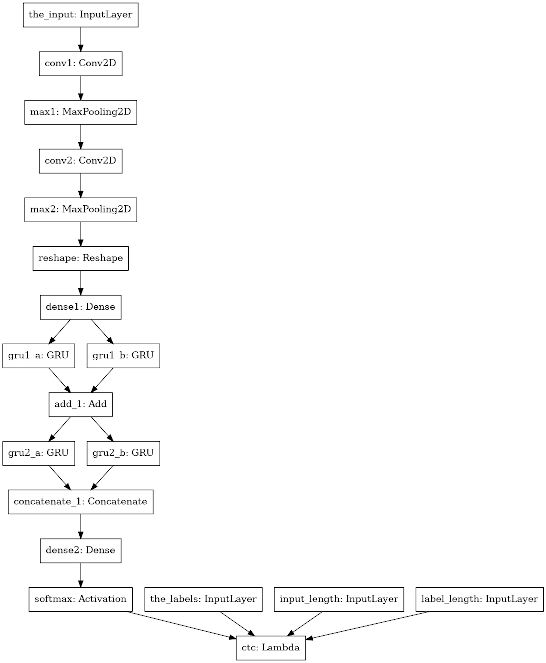
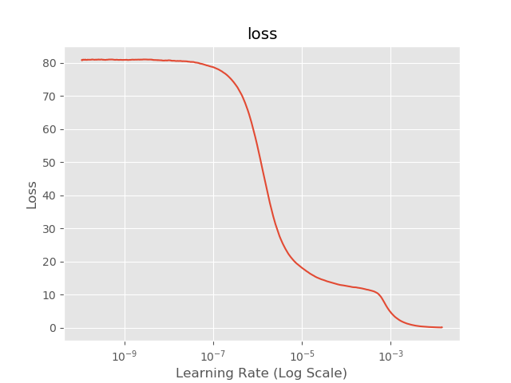
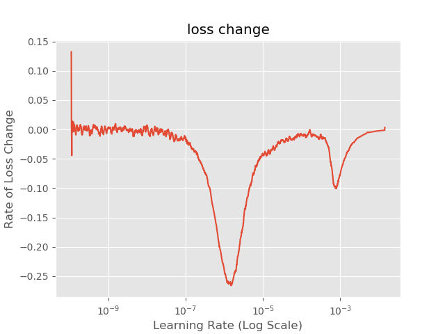
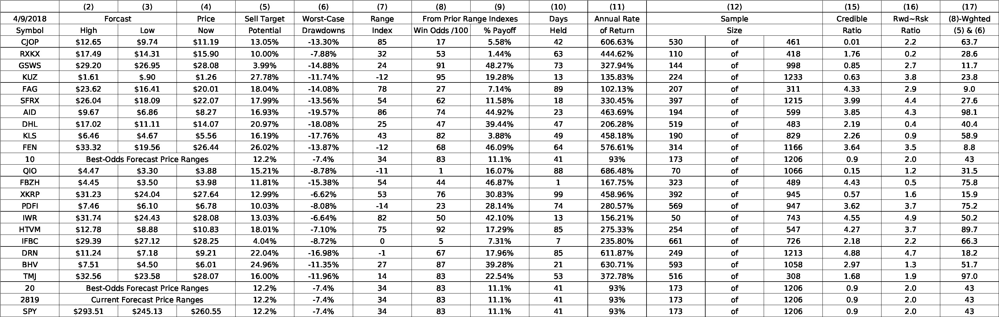

ki-ocr-spreadsheet
==============================

The projects aims to convert a spreadsheet exported as JPEG into a CSV file containing spreadsheet's data by using a DNN.

Project Structure
------------

    ├── LICENSE
    ├── Makefile                 <- Makefile with commands like `make data` or `make train`
    ├── README.md                <- Top-level README for developers using this project
    ├── data
    │   ├── processed            <- Final, canonical data sets for modeling
    |   |   ├── train            <- data used for training
    |   |   └── test             <- data used for testing
    |   |   └── val              <- data used for validation
    |   |
    │   └── raw                  <- Original, immutable data dump
    │
    ├── models                   <- Trained and serialized models, model predictions, or model summaries
    │
    └── src                      <- Source code for use in this project.
       ├── __init__.py           <- Makes src a Python module
       │
       ├── data                  <- Scripts and binaries to generate data
       │   ├── generate.cpp      <- generate spreadsheets (PDF + CSV)
       │   ├── generate_data.py  <- generate raw data (JPEG + CSV)
       |   ├── offapi.rdb        <- db required by LibreOffice runtime
       |   ├── template.ods      <- LibreOffice template required for data generation
       |   └── trim.cpp          <- trim JPEG
       │
       ├── features              <- Scripts and binaries to turn raw data into features for modeling
       │   ├── build_features.py <- extract features from data - generate training, validation and testing data sets
       │   └── split.cpp         <- split JPEG containing spreadsheet
       │
       └── models                <- Scripts to train models and then use trained models to make
           │                        predictions
           |── find_lr.py        <- find best learning rate
           |── generator.py      <- data generator iterates over data set
           |── lrf.py            <- learning rate finder
           |── model.py          <- DNN model
           |── test.py           <- test model with testing data set
           └── train.py          <- train DNN model; find best learning rate

<small>Project based on the <a target="_blank" href="https://drivendata.github.io/cookiecutter-data-science/">cookiecutter data science project template</a>. #cookiecutterdatascience</small>

Parameters
----------
- package `dotenv` is used to manage parameters
- file `.env` contains parameter:

 | symbol            | value                   | description                                                  |
 |-------------------|-------------------------|--------------------------------------------------------------|
 | PATH_RAW          | "data/raw"              | relative ptah to generated raw data (PDF+CSV)                |
 | PATH_PROCESSED    | "data/processed"        | relative path to features (JPEGs+CSVs)                       |
 | PATH_MODELS       | "models"                | relative path to DNN models + data                           |
 | PATH_OFFAPI       | "src/data/offapi.rdb"   | relative path to LibreOffice RDB                             |
 | PATH_OFFTMPL      | "src/data/template.ods" | relative path to LibreOffice template file                   |
 | BATCH_SIZE        | 64                      |                                                              |
 | CHUNK_SIZE        | 100                     | amount of parallel jobs used for feature generation          |
 | DATA_SIZE         | 10000                   | amount of generated spreadsheets                             |
 | DOWNSAMPLE_FACTOR | 4                       |                                                              |
 | EPOCHS            | 150                     |                                                              |
 | IMAGE_HEIGHT      | 32                      |                                                              |
 | IMAGE_WIDTH       | 128                     |                                                              |
 | LEARNING_RATE     | 1e-6                    | learning rate found by learning rate finder                  |
 | MAX_LEARNING_RATE | 1e+1                    | maximal learning rate used by learning rate finder           |
 | MIN_LEARNING_RATE | 1e-10                   | minimal learning rate used by learning rate finder           |
 | NGPUS             | 2                       | GPUs used (1 < NGPUS ? MirroredStrategy : OneDeviceStrategy) |
 | TRAIN_FRAC        | 0.8                     | fraction of data used for training                           |
 | VAL_FRAC          | 0.1                     | fraction oof data used for validation                        |

Data Generation
---------------
- `make data` instruments LibreOffice to generate spreadsheets (parameter `DATASETS`)
- each spreadsheet is stored as PDF and CSV
- the spreadsheets contains random data that mimics financial data
- each PDF is converted to JPEG via `convert` (part of `ImageMagic`)
- each JPEG is trimmed to the size of the table
- the raw data are stored in `PATH_RAWA`

Feature Extraction
------------------
- `make features` generates the features
- each JPEG is splitted into multiple JPEGs, each containing one spreadsheet cell
- the program above are forked
- in order to prevent resource exhaustion, the feature extraction is executed in batches of `CHUNK_SIZE` size
- each splitted JPEG is resized to 32x128 pixel by finding the contours of the text with `cv2.findContours()`
  and resizing according to `cv2.copyMakeBoarder()` nd `cvs.resize()`
- the JPEGs are stored in directories `train`, `test` and `val` (below diretory `PATH_PROCESSED`)
- each of these folders contains a `labels.csv` file containg the mapping between the image (spreadsheet cell) and its content (text)

DNN Model
---------

- `make train` trains the model; if 1 < `NCORS` the model is trained on multiple GPUs
- the model is serialized to file `model.h5` in `PATH_MODLES`

- `make test` tests the accuracy of the model using data from directory `test`

- `make find-lr` finds the optimal learning rate using class `LRFinder`
- `LRFinder` measures the loss from `MIN_LEARNING_RATE` till `MAX_LEARNING_RATE`
- two plots are generated and stored in directory `PATH_MODELS`

- the plot shows shows that the steepest descent is around `1e-6`

- the Minimum (strongest change of loss/descent) achieves a learning rate at `1e-6`

Converting
----------
- `python predict.py --file <path-to-jpeg> --outdir <path-to-output>` converts a spreadsheet given as JPEG into a CSV file containing spreasheet's data

OpenOffice spreadsheed exported as JPEG:

CSV converted from JPEG via DNN:

| Symbol | High   | Low    | Now    | Sell Target Potential | Worst-Case Drawdowns | Range Index | Win Odds/100 | % Payoff | Days Held | Annual Rate of Return | Sample Size |      | Creadible Ratio | Rwd~Rsk Ratio | Wghted |
|--------|--------|--------|--------|-----------------------|----------------------|-------------|--------------|----------|-----------|-----------------------|-------------|------|-----------------|---------------|--------|
| CJOP   | $12.65 | $9.74  | $11.19 | 13.05%                | -13.30%              | 85          | 17           | 5.58%    | 42        | 606.63%               | 530         | 461  | 0.01            | 2.2           | 63.7   |
| RXKX   | $17.49 | $14.31 | $15.90 | 10.00%                | -7.88%               | 32          | 53           | 1.44%    | 63        | 444.62%               | 110         | 418  | 1.76            | 0.2           | 28.6   |
| GSWS   | $29.20 | $26.95 | $28.08 | 3.99%                 | -14.88%              | 24          | 91           | 48.27%   | 73        | 327.94%               | 144         | 998  | 0.85            | 2.7           | 11.7   |
| KUZ    | $1.61  | $.90   | $1.26  | 27.78%                | -11.74%              | -12         | 95           | 19.28%   | 13        | 135.83%               | 224         | 1233 | 0.63            | 3.8           | 23.8   |
| FAG    | $23.62 | $16.41 | $20.01 | 18.04%                | -14.08%              | 78          | 27           | 7.14%    | 89        | 102.13%               | 207         | 311  | 4.33            | 2.9           | 9.0    |
| SFRX   | $26.04 | $18.09 | $22.07 | 17.99%                | -13.56%              | 54          | 62           | 11.58%   | 18        | 330.45%               | 397         | 1215 | 3.99            | 4.4           | 27.6   |
| AID    | $9.67  | $6.86  | $8.27  | 16.93%                | -19.57%              | 86          | 74           | 44.92%   | 23        | 463.69%               | 194         | 599  | 3.85            | 4.3           | 98.1   |
| DHL    | $17.02 | $11.11 | $14.07 | 20.97%                | -18.08%              | 25          | 47           | 39.44%   | 47        | 206.28%               | 519         | 483  | 2.19            | 0.4           | 40.4   |
| KLS    | $6.46  | $4.67  | $5.56  | 16.19%                | -17.76%              | 43          | 82           | 3.88%    | 49        | 458.18%               | 190         | 829  | 2.26            | 0.9           | 58.9   |
| FEN    | $33.32 | $19.56 | $26.44 | 26.02%                | -13.87%              | -12         | 68           | 46.09%   | 64        | 576.61%               | 314         | 1166 | 3.64            | 3.5           | 8.8    |
| QIO    | $4.47  | $3.30  | $3.88  | 15.21%                | -8.78%               | -11         | 1            | 16.07%   | 88        | 686.48%               | 70          | 1066 | 0.15            | 1.2           | 31.5   |
| FBZH   | $4.45  | $3.50  | $3.98  | 11.81%                | -15.38%              | 54          | 44           | 46.87%   | 1         | 167.75%               | 323         | 489  | 4.43            | 0.5           | 75.8   |
| XKRP   | $31.23 | $24.04 | $27.64 | 12.99%                | -6.62%               | 53          | 76           | 30.83%   | 99        | 458.96%               | 392         | 945  | 0.57            | 1.6           | 15.9   |
| PDFI   | $7.46  | $6.10  | $6.78  | 10.03%                | -8.08%               | -14         | 23           | 28.14%   | 74        | 280.57%               | 569         | 947  | 3.62            | 3.7           | 75.2   |
| IWR    | $31.74 | $24.43 | $28.08 | 13.03%                | -6.64%               | 82          | 50           | 42.10%   | 13        | 156.21%               | 50          | 743  | 4.55            | 4.9           | 50.2   |
| HTVM   | $12.78 | $8.88  | $10.83 | 18.01%                | -7.10%               | 75          | 92           | 17.29%   | 85        | 275.33%               | 254         | 547  | 4.27            | 3.7           | 89.7   |
| IFBC   | $29.39 | $27.12 | $28.25 | 4.04%                 | -8.72%               | 0           | 5            | 7.31%    | 7         | 235.80%               | 661         | 726  | 2.18            | 2.2           | 66.3   |
| DRN    | $11.24 | $7.18  | $9.21  | 22.04%                | -16.98%              | -1          | 67           | 17.96%   | 85        | 611.87%               | 249         | 1213 | 4.88            | 4.7           | 18.2   |
| BHV    | $7.51  | $4.50  | $6.01  | 24.96%                | -11.35%              | 27          | 87           | 39.28%   | 21        | 630.71%               | 593         | 1058 | 2.97            | 1.3           | 51.7   |
| TMJ    | $32.56 | $23.58 | $28.07 | 16.00%                | -11.96%              | 14          | 83           | 22.54%   | 53        | 372.78%               | 516         | 308  | 1.68            | 1.9           | 97.0   |
